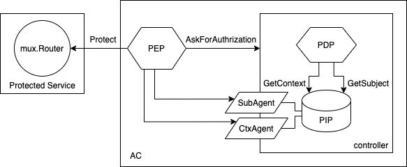
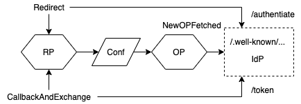
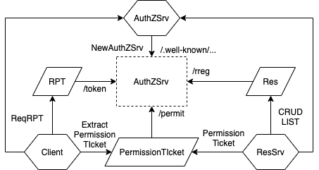

# ZTF-Protptype
研究の PoC として作成したプロトタイプ。

# 過去の発表
- [DICOMO2020](http://tsys.jp/dicomo/2020/program/program_abst.html#4E-3): [branch](https://github.com/hatake5051/ztf-prototype/tree/dicomo2020)
- PerFlow2021: [branch](https://github.com/hatake5051/ztf-prototype/tree/percom)

# プロトタイプのユースケース
- [環境構築](https://github.com/hatake5051/ztf-prototype/blob/master/example/how_to_run.md)
- [動作例の説明](https://github.com/hatake5051/ztf-prototype/blob/master/example/usecase.md)

# 各パッケージの紹介
ディレクトリごとに説明する
## ac
ZTF の RP のアクセス制御部を実装する。

### ac/controller
- controller は PDP と PIP をまとめる
- PEP は controller と通信する
### ac/pdp
- Policy Decision Point はアクセス要求に対して認可判断を行う。
### ac/pep
- Policy Enforcement Point は PDP が認可判断した結果を実行する。
### ac/pip
- Policy Information Point は PDP が認可判断する上で必要な情報を提供する。
- 具体的にはアクセスしてきたユーザの `Subject` とそのユーザの `Context` を提供する。
- `Subject` は OpenID Connect を利用して外部 Identity Provider から取得することを前提としている
- `Context` は CAEP を利用して外部 Context Attribute Provider から取得することを前提としている

## actors

## caep
Continusou Access Evaluation Protocol の Transmitter と Receiver を実装する。
## example
プロトタイプのユースケース。
## images
ドキュメントのための画像
## openid
OpenID Connect の RP を実装する。

## uma
User Managed Access のリソースサーバとクライアントを実装する。

